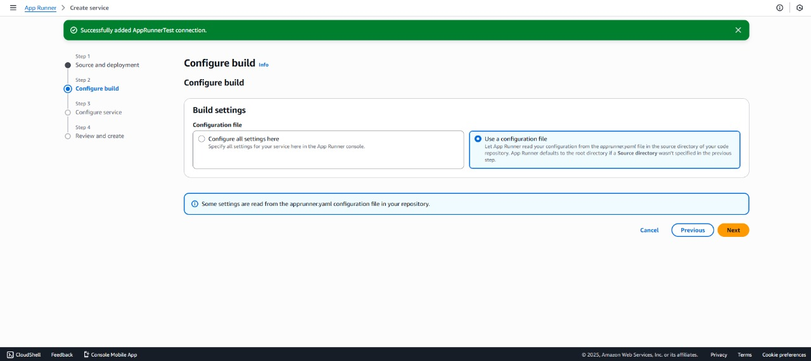
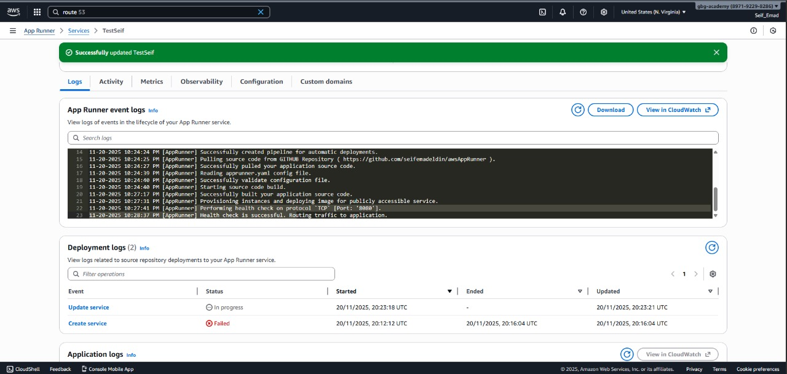
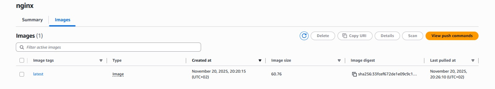
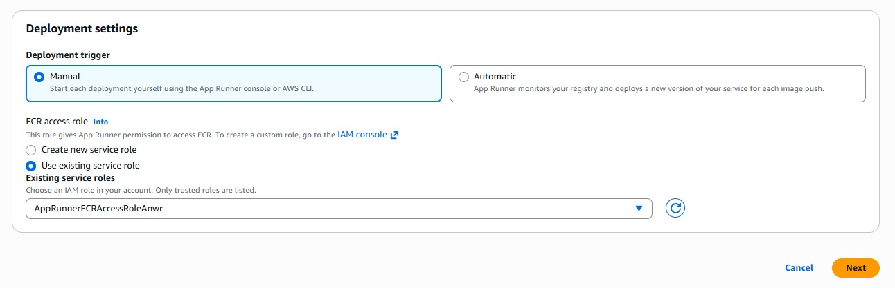
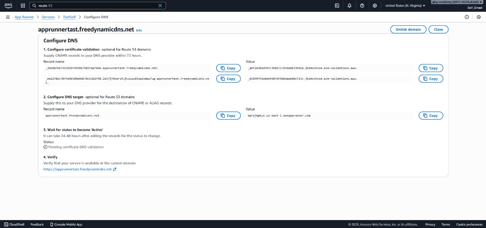

# Task 4: Deploying a Serverless Web Application Using AWS App Runner

## 📋 Scenario Overview
**Scenario:** A startup is exploring modern cloud-native options for deploying containerized applications with minimal infrastructure management. The team selected **AWS App Runner** to deploy a web application directly from source code and container images. This approach offers built-in scalability, load balancing, and HTTPS without the need to manage servers or orchestrators.

---

## 🚀 Deployment Strategy
This documentation covers two deployment methods implemented during this task:
1.  **Source Code Deployment (CI/CD):** Connecting a GitHub repository directly to App Runner.
2.  **Container Deployment:** Building a Docker image and deploying via Amazon ECR.

---

## ⚙️ Option 1: Deployment via Source Code (GitHub)
*This method leverages App Runner's ability to build and deploy directly from a code repository using a configuration file.*

### Steps Taken:
1.  **Repository Setup:**
    * We utilized a ready-to-use web application source code.
    * Uploaded the code to a dedicated GitHub repository.
2.  **App Runner Configuration:**
    * **Source:** Selected "Source Code Repository".
    * **Provider:** GitHub (Linked the account to AWS).
    * **Deployment Trigger:** Set to **Automatic**.
        * *Benefit:* Any commit pushed to the main branch automatically triggers a new deployment.
3.  **Build Configuration (`apprunner.yaml`):**
    * Instead of manual UI configuration, we utilized a configuration file named `apprunner.yaml` included in the repository root.
    * This file contained all necessary build and start commands, ensuring the infrastructure setup is defined as code.

### 📸 Option 1 Screenshots

*Description: Configuring the GitHub repository link in AWS App Runner.*

*Description: Successful deployment from source code.*

---

## 🐳 Option 2: Deployment via Container Registry (ECR)
*This method simulates a workflow where the application is pre-built into a Docker image.*

### Steps Taken:
1.  **Containerization:**
    * Built the Docker image from the source code.
    * Pushed the image to **Amazon Elastic Container Registry (ECR)**.
2.  **App Runner Configuration:**
    * **Source:** Selected "Container Registry".
    * **Provider:** Amazon ECR.
    * **Image:** Selected the specific image tag uploaded in the previous step.
3.  **IAM Role Setup:**
    * Created a specific **IAM Role** to grant AWS App Runner permission to pull images from ECR.
4.  **Service Settings:**
    * Configured CPU and Memory settings identical to Option 1 to ensure consistent performance comparison.

### 📸 Option 2 Screenshots

*Description: The container image uploaded to Amazon ECR.*

*Description: Configuring the IAM role for ECR access.*

---

## 🌐 Custom Domain & HTTPS Configuration
AWS App Runner provides a default secure URL (`https://*.awsapprunner.com`). We also performed the optional task of mapping a custom domain.

* **Default HTTPS:** Confirmed that the default AWS URL was secured automatically.
* **Custom Domain:**
    * Obtained a free subdomain.
    * Configured the CNAME records in the DNS provider to point to the App Runner domain.
    * **Result:** The verification process is currently in progress. As noted by AWS, DNS propagation and certificate validation can take between **24 to 48 hours**.

---

## 🧪 Testing Results
After deployment, functional testing was conducted:
1.  **Access:** Successfully accessed the application via the default App Runner HTTPS link.
2.  **CI/CD:** Verified that changes pushed to the GitHub repo triggered an update in the application automatically (Option 1).
3.  **Logic:** Confirmed that application routing and environment variables were functioning as expected.

---

## ⚠️ Challenges Faced
* **Source Code Availability:** The primary challenge was locating a reliable, working source code suitable for testing. We iterated through a few options before finding a stable codebase that deployed without internal errors.

---

## 📝 Conclusion
AWS App Runner proved to be a highly efficient service for deploying web applications. Using the `apprunner.yaml` file (Option 1) provided the most streamlined experience by treating configuration as code, while Option 2 demonstrated the flexibility of using pre-hardened container images.
